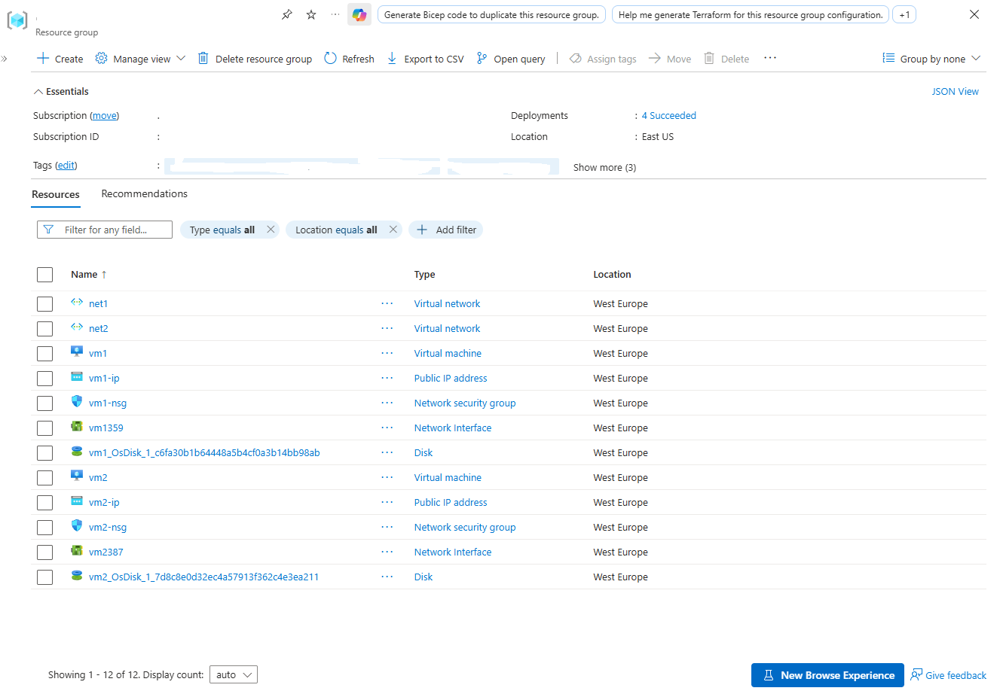
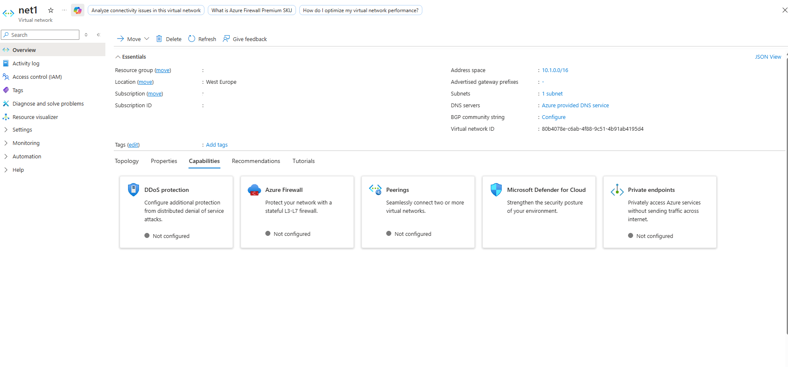
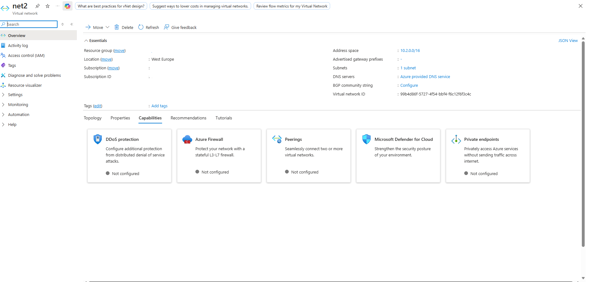
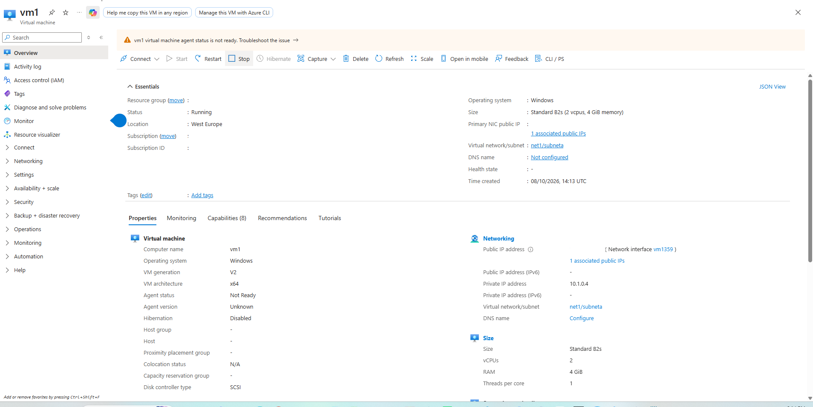
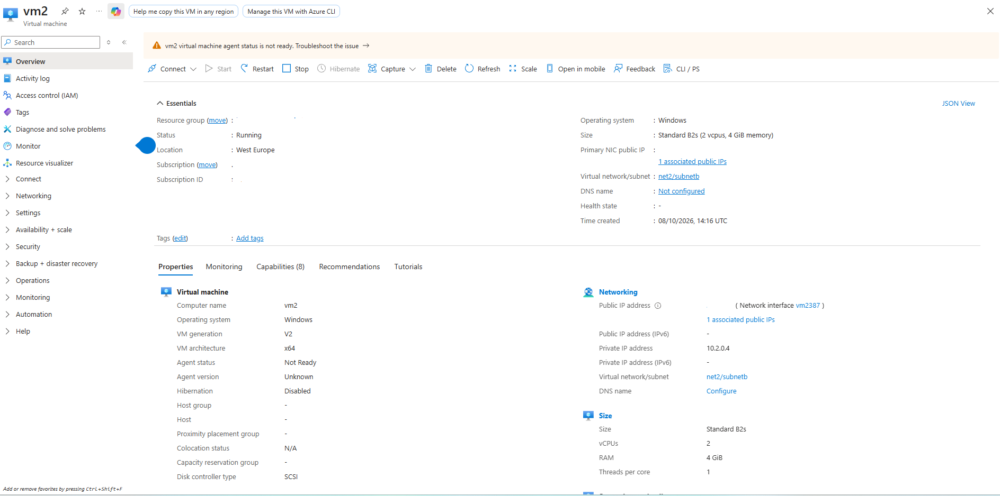
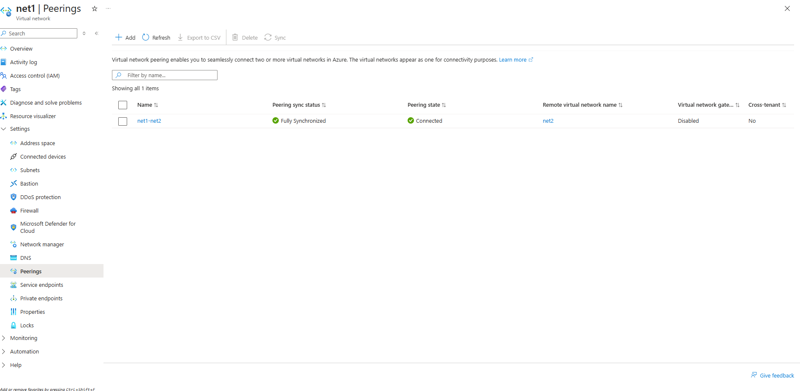
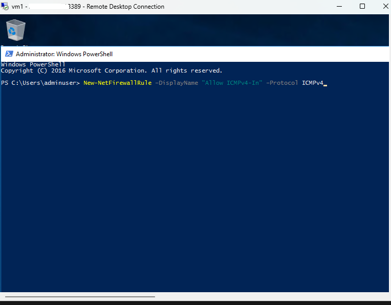
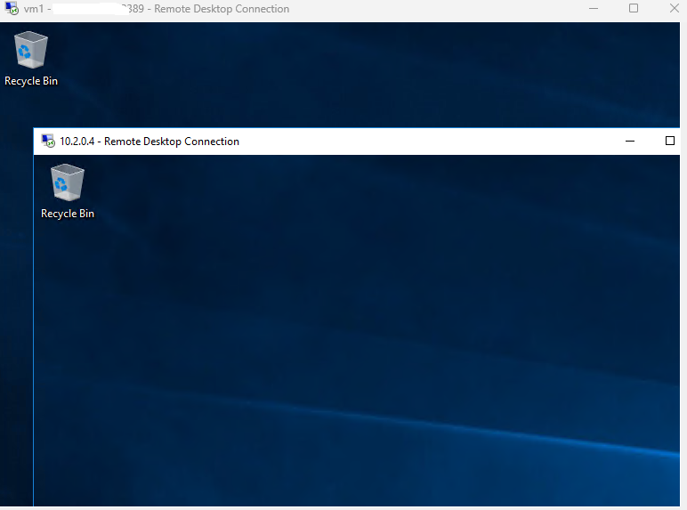

# Virtual Network Peering and Private Connectivity

Documentation covering the deployment of two isolated virtual networks, provisioning of compute resources, establishment of bidirectional virtual network peering, and validation of private routing via RDP and ICMP protocols in the West Europe region.

---

## 1. Architecture & Provisioned Resources

### Core Infrastructure Topology

| Resource Type | Resource Name | Network Configuration | Region |
| :--- | :--- | :--- | :--- |
| **Virtual Network 1** | `net1` | Address Space: `10.1.0.0/16`   Subnet: `subneta` (`10.1.0.0/24`) | West Europe |
| **Virtual Network 2** | `net2` | Address Space: `10.2.0.0/16`   Subnet: `subnetb` (`10.2.0.0/24`) | West Europe |
| **Virtual Machine 1** | `vm1` | Private IP: `10.1.0.4`   Compute: Standard B2s, Windows Server 2016 | West Europe |
| **Virtual Machine 2** | `vm2` | Private IP: `10.2.0.4`   Compute: Standard B2s, Windows Server 2016 | West Europe |
| **Network Peering** | `net1-net2` | Bidirectional Sync, Connected State | West Europe |

---

### Provisioned Environment Validation

*Resource group inventory confirming the deployment of both virtual networks, virtual machines, and associated networking interfaces.*

---

## 2. Step-by-Step Implementation

### Step 1: Provision Isolated Virtual Networks

Configured two independent virtual networks with distinct, non-overlapping address spaces to simulate isolated environments prior to peering.

* **Primary VNet (`net1`):** Configured with `10.1.0.0/16` address space and a dedicated subnet (`subneta`).
* **Secondary VNet (`net2`):** Configured with `10.2.0.0/16` address space and a dedicated subnet (`subnetb`).

*Reviewing the address space and subnet configurations for net1.*

*Reviewing the address space and subnet configurations for net2.*

---

### Step 2: Deploy Compute Resources

Deployed a Windows Server 2016 virtual machine into each respective virtual network, ensuring they acquired dynamic private IP addresses from their local subnets.

* **`vm1`:** Successfully allocated `10.1.0.4` within `net1`.
* **`vm2`:** Successfully allocated `10.2.0.4` within `net2`.

*Validating the network interface, private IP allocation, and running status of vm1.*

*Validating the network interface, private IP allocation, and running status of vm2.*

---

### Step 3: Establish Virtual Network Peering

Created a bidirectional virtual network peering link between `net1` and `net2` to enable seamless internal traffic routing using the Microsoft backbone infrastructure.

* **Peering Link:** `net1-net2`
* **Peering State:** Connected
* **Sync Status:** Fully Synchronized

*Confirming the successful synchronization and active connection state of the VNet peering link.*

---

### Step 4: Configure OS-Level Firewall for ICMP

Accessed `vm1` via Remote Desktop and configured the Windows Defender Firewall to allow inbound ICMPv4 traffic, enabling ping responses for connectivity validation across the peered networks. The configuration was applied utilizing the native PowerShell `New-NetFirewallRule` command.

*Executing the firewall modification within the vm1 PowerShell environment to permit inbound ICMP requests.*

---

### Step 5: Validate Private Connectivity

Verified the peering routing table by initiating a nested Remote Desktop session from `vm1` directly to the private IP address of `vm2` (`10.2.0.4`), confirming that traffic successfully traversed the peered boundary without traversing the public internet.

*Successful nested RDP connection from vm1 to vm2 utilizing the internal 10.2.0.4 address.*
